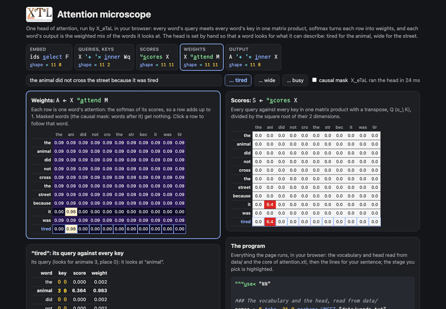

# Attention microscope

One head of attention, the operation at the heart of a transformer, as
array algebra: every word's query meets every word's key in one matrix
product, softmax turns each row into weights, and each word's output
is the weighted mix of the words it looks at. The head is set by hand
so that a word looks for what it can describe: "tired" finds the
animal, "wide" finds the street.

Live: [Attention microscope](https://softwarewrighter.github.io/X_eTaL-ML/attention/)
(type a sentence, switch the causal mask, click a word to see its
query against every key).

[](https://softwarewrighter.github.io/X_eTaL-ML/attention/)

## Run it

From a clone of this repository (Rust, git and `just`):

```bash
just xetal               # fetch and build the pinned X_eTaL (once)
just run attention       # the heatmaps and what each word looks at
just tour attention      # each statement, then its result, paced
just serve attention     # the web app at http://127.0.0.1:8435/
just test-demo attention # its CLI and browser baselines and the web app's tests
```

## The program

Attention is two lines:

```
u:s_cores := { X -> ((X '+ '* i_nner Wq) '+ '* i_nner o_\ X '+ '* i_nner Wk) / 2.0 ^ 0.5 }
u:a_ttend := { X M -> nn:s_oftmax (u:s_cores X) - 1e9 * 1.0 - M }
```

Read right to left:

- `X '+ '* i_nner Wk` gives every word's key (n x 2), and `o_\`
  transposes it (2 x n). `X '+ '* i_nner Wq` gives every query (n x 2).
  Their matrix product is every query against every key at once:
  S = Q K^T, n x n, divided by the square root of the 2 dimensions.
- The mask M has 1 where a word may look. Subtracting 1e9 where it is
  0 makes those scores vanish in the softmax: the causal mask
  `f_loat (r_ange n) '>= t_able r_ange n` lets each word see only itself
  and the words before it, as when a model generates text.
- `nn:s_oftmax` (the [NN library](../../libs/NN/docs/README.md)) turns
  each row into weights that add up to 1, and the output is
  `A '+ '* i_nner X`: each word becomes the weighted mix of the
  features of the words it attends to (here the values are the
  embeddings themselves).

## What it prints

1. The weights for "the animal did not cross the street because it
   was tired", as a heatmap of words against words.
2. What each word looks at most: "it" and "tired" find "animal"; words
   with nothing to look for spread their weight evenly (`-`).
3. The output for "tired": it has taken on the animal's feature.
4. The same with the causal mask.
5. "... because it was wide": "wide" finds "street". "it" still finds
   "animal": one head reads each word on its own, so "it" cannot know
   which word comes after it. Resolving it needs a second layer, whose
   queries are built from the first layer's outputs.

## The data

`data/` holds what the program reads, set by hand (no training):

| File | What |
| ---- | ---- |
| `words.txt` | the 21 words, one per line, padded to 8 characters (the last, `?`, is any other word) |
| `features.txt` | a row of 8 features per word: animate, place, pronoun, verb, describes the animate, describes a place, function word, not |
| `wq.txt`, `wk.txt` | the head's query and key weights, 8 x 2: a pronoun or "tired" asks for the animate, "wide" for a place; the animate and places answer |

## Workarounds

None.
