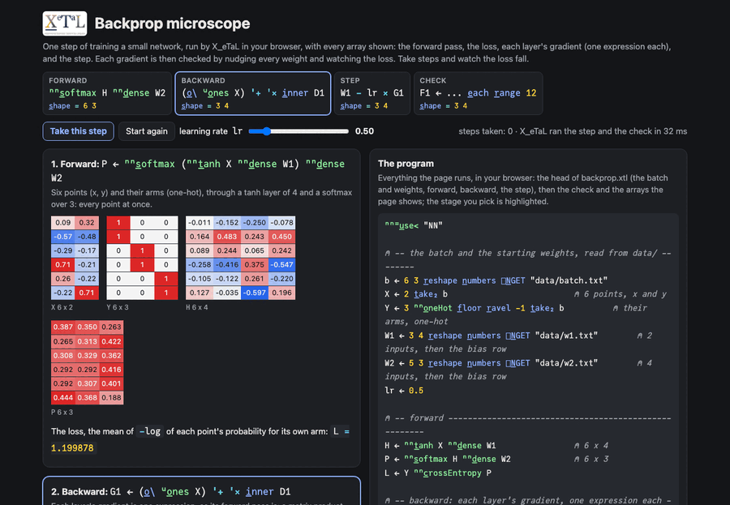

# Backprop microscope

One step of training a small network, every array shown: the forward
pass, the loss, each layer's gradient as one X_eTaL expression, and
the step. Then each of the 27 gradients is checked without any
calculus, by nudging its weight and watching the loss move.

Live: [Backprop microscope](https://softwarewrighter.github.io/X_eTaL-ML/backprop/)
(take steps and watch the loss fall; change the learning rate and
watch it overshoot).

[](https://softwarewrighter.github.io/X_eTaL-ML/backprop/)

## Run it

From a clone of this repository (Rust, git and `just`):

```bash
just xetal               # fetch and build the pinned X_eTaL (once)
just run backprop        # probabilities, loss before and after, gradients, the check
just tour backprop       # each statement, then its result, paced
just serve backprop      # the web app at http://127.0.0.1:8435/
just test-demo backprop  # its CLI and browser baselines and the web app's tests
```

## The program

A network of 2 inputs, 4 tanh units and a softmax over 3 classes, on
six points of a spiral (two from each arm). Forward:

```
H := nn:t_anh X nn:d_ense W1
P := nn:s_oftmax H nn:d_ense W2
L := Y nn:c_rossEntropy P
```

Backward, one expression per layer:

```
u:o_nes := { x -> x c_at_2 ((t_ally x) c_at 1) r_eshape 1.0 }
D2 := (P - Y) / f_loat t_ally X
G2 := (o_\ u:o_nes H) '+ '* i_nner D2
D1 := (D2 '+ '* i_nner o_\ -1 d_rop W2) * 1.0 - H * H
G1 := (o_\ u:o_nes X) '+ '* i_nner D1
```

Read right to left:

- `D2` is how the loss changes with each output score: with softmax
  and cross-entropy together it is simply the probabilities minus the
  one-hot answers, over the batch size.
- `G2`, W2's gradient: the layer's input (with a column of 1s, since
  the bias is W2's last row, as `nn:d_ense` keeps it), transposed
  (`o_\`), times `D2`. One matrix product sums every example's share.
- `D1` carries the error back: through W2 without its bias row, then
  through tanh, whose slope is `1 - H * H`.
- `G1`, W1's gradient, is the same shape of expression as `G2`.

The step moves every weight against its gradient:
`V1 := W1 - lr * G1`.

## The check

Each gradient is computed a second time by brute force: nudge one
weight up and down by e = 0.00001, run the whole network twice, and
take (L(w + e) - L(w - e)) / 2e. For all 27 weights that is 54 forward
passes (`e_ach` over the weights' positions); the largest difference
from the analytic gradients is printed and must be below 1e-8. This
is the habit Mike Powell's APL tutorials on handwritten digits teach:
derive the gradient, then check it.

## What it prints

1. Each point's probabilities for the three arms.
2. The loss before and after one step (it falls).
3. W1's and W2's gradients, rounded.
4. A 1: the analytic and finite-difference gradients agree.

## The data

`data/batch.txt` holds the six points (x, y, arm), taken from the
network-macro demo's test points; `data/w1.txt` and `data/w2.txt` the
starting weights, fixed (seeded random numbers, biases 0), each with
its bias as the last row.

## Background

Every neural-network work on the APL Wiki trains its network in APL:
Artem Shinkarov's "Convolutional neural networks in APL" (2019), Aaron
Hsu and Rodrigo Girao Serrao's U-Net in APL (2023), Serrao's workshop,
Mike Powell's tutorials. This is the first demo here that trains;
the next ones train a whole network live and generate the backward
pass from a network's one-line spec.
