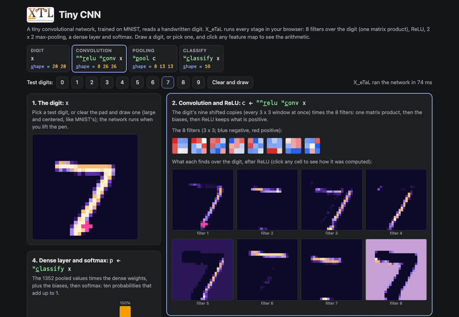

# Tiny CNN

A tiny convolutional network reads handwritten digits, and shows what
it sees on the way: 28 x 28 -> 8 filters of 3 x 3 -> ReLU -> 2 x 2
max-pooling -> dense -> softmax. Every stage is one array expression
over the whole picture: the convolution is the picture's nine shifted
copies times the filters, one matrix product.

## Run it

From a clone of this repository (Rust, git and `just`):

```bash
just xetal               # fetch and build the pinned X_eTaL (once)
just run cnn-digits      # the digit, filters, feature maps, pooled maps, probabilities
just tour cnn-digits     # each statement, then its result, paced
just show cnn-digits     # the same as a notebook, unclipped
just serve cnn-digits        # the web app at http://127.0.0.1:8435/
just test-demo cnn-digits    # its CLI and browser baselines and the web app's tests
```

Live: [Tiny CNN](https://softwarewrighter.github.io/X_eTaL-ML/cnn-digits/)
(draw a digit or pick one; X_eTaL runs every stage in your browser;
click any feature map to see its patch times its filter).

[](https://softwarewrighter.github.io/X_eTaL-ML/cnn-digits/)

## What the command line prints

1. A test digit (a 7), 28 x 28, shaded darkest to brightest.
2. The 8 learned filters, 3 x 3 each, from most negative (`=`) to
   most positive (`#`).
3. The 8 feature maps after convolution and ReLU, 26 x 26 each: what
   each filter finds (edges at different angles, strokes, and one
   that answers to the background, so the 7 shows in it as a gap).
4. The 8 maps after 2 x 2 max-pooling, 13 x 13 each.
5. The ten probabilities as bars, then in percent: the network reads
   a 7.
6. All ten test digits (0 to 9): what the network reads in each (all
   right) and how sure it is (the 3 only 57%).
7. A `1`: X_eTaL's probabilities for the ten digits equal those of the
   trainer's own (Rust) forward pass, to within 1e-9.

## The program

The whole network is a few lines:

```
u:c_onv := { x ->
  v := 1 d_rop_4 -1 d_rop_4 1 d_rop_3 -1 d_rop_3 -1 0 1 o_-_2 -1 0 1 o_-_2 x
  (8 c_at 26 c_at 26) r_eshape (k9 '+ '* i_nner (9 c_at 676) r_eshape v) + bc 'l_eft t_able o_ffsets 676
}
u:p_ool := { x -> 'm_ax r_/_3 'm_ax r_/_5 (8 c_at 13 c_at 2 c_at 13 c_at 2) r_eshape x }
u:c_lassify := { x -> f_irst nn:s_oftmax ((1 c_at 1352) r_eshape r_avel u:p_ool nn:r_elu u:c_onv x) nn:d_ense wb }
```

Read right to left:

- `-1 0 1 o_-_2 -1 0 1 o_-_2 x` rotates the 28 x 28 picture by every
  offset in both directions at once: 3 x 3 x 28 x 28, the nine shifted
  copies. Dropping the first and last row and column of each
  (`d_rop_3`, `d_rop_4`) leaves the valid 26 x 26 windows (no wrap).
- As 9 x 676 (nine values under each window position), one inner
  product with the filters (8 x 9) gives all eight convolutions at
  once; the biases are spread across each map.
- Pooling reshapes each 26 x 26 map into 13 x 2 x 13 x 2 blocks and
  takes the largest along the two block axes.
- `nn:r_elu`, `nn:d_ense` (the 1352 pooled values times the dense
  weights, plus the bias row) and `nn:s_oftmax` come from the
  [NN library](../../libs/NN/docs/README.md).

The display is array programming too: `u:m_aps` scales each map from
its own smallest to largest value and picks a shade with `s_elect`,
`u:s_ide` places maps side by side (a gap column, `t_ranspose`, a
reshape), and the bars are one comparison table,
`counts '> t_able o_ffsets 50`.

## The data

`data/` holds what the program reads with `n_umbers []N_GET`:

| File | What |
| ---- | ---- |
| `filters.txt` | 8 lines: each filter's 9 weights (row by row), then its bias |
| `dense.txt` | 1352 lines of 10 weights (one per pooled value, filter by filter, row by row), then the 10 biases (the layout `nn:d_ense` takes) |
| `samples.txt` | ten MNIST test digits (the first of each class), 28 lines of 28 pixels each, 0 to 1 |
| `expected.txt` | the trainer's probabilities for the ten samples, for the final check |

They are written by `train/`, a small Rust program with no
dependencies: it trains the network on the 60,000 MNIST training
digits (SGD with momentum, cross-entropy, 3 passes, a fixed shuffle:
the same weights every run, in about 12 seconds). The written weights
(rounded to 5 decimals) classify 9782 of the 10,000 MNIST test digits
(97.82%) right. MNIST itself is downloaded, not committed:

```bash
just cnn-train          # fetch MNIST (scripts/mnist.sh), train, write data/
just bless cnn-digits   # accept the program's new output (review the diff)
```

`scripts/mnist.sh` downloads the four MNIST files (LeCun, Cortes and
Burges) from the PyTorch project's public mirror into `work/mnist/`
(gitignored), checks their MD5 sums and unpacks them.

## Workarounds

The page shows everything it runs: the program's head (the import,
the network read from `data/`, the core), then its own lines for the
digit; a drawn digit's 784 values are written `...` with a comment.

The ten digits are classified one at a time (`e_ach`, one number per
call), because `e_ach` cannot yet return an array per item (nested
results come later upstream), and the convolution works on one
picture. The dense layer is a matrix product of a 1 x 1352 row, slow
per multiply-add (ask M3 in
[`docs/xetal-asks.md`](../../docs/xetal-asks.md)), though the whole
program runs in about 2 seconds.
