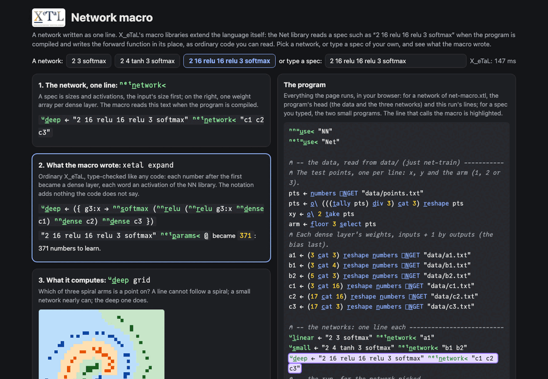

# Network macro

A network written as one line. X_eTaL's macro libraries (`.xtlm`)
extend the language itself: the [Net](../../libs/Net/docs/README.md)
library reads a spec such as `"2 16 relu 16 relu 3 softmax"` when the
program is compiled and writes the forward function in its place, as
ordinary code that is then type-checked like any other. Nothing is
hidden: `xetal expand` shows what was written.

Live: [Network macro](https://softwarewrighter.github.io/X_eTaL-ML/net-macro/)
(pick one of three networks, or type a spec of your own, and see the
function the macro wrote, its parameter count, and what the network
decides).

[](https://softwarewrighter.github.io/X_eTaL-ML/net-macro/)

## Run it

From a clone of this repository (Rust, git and `just`):

```bash
just xetal               # fetch and build the pinned X_eTaL (once)
just run net-macro       # parameter counts, accuracies, the three decision maps
just expand net-macro    # the program after macro expansion: what the macros wrote
just tour net-macro      # each statement, then its result, paced
just serve net-macro     # the web app at http://127.0.0.1:8435/
just test-demo net-macro # its CLI and browser baselines and the web app's tests
```

## The program

Three networks for one task (which of three spiral arms is a point
on?), each one line of `net-macro.xtl`:

```
u:l_inear := "2 3 softmax" net:n_etwork< "a1"
u:s_mall := "2 4 tanh 3 softmax" net:n_etwork< "b1 b2"
u:d_eep := "2 16 relu 16 relu 3 softmax" net:n_etwork< "c1 c2 c3"
```

A spec is sizes and activations, the input's size first: each number
after the first is a dense layer, using the next weight array named on
the right; each word is an activation of the
[NN library](../../libs/NN/docs/README.md). What the three lines
become (`just expand net-macro`):

```
u:l_inear := ({ g1:x -> nn:s_oftmax g1:x nn:d_ense a1 })
u:s_mall := ({ g2:x -> nn:s_oftmax (nn:t_anh g2:x nn:d_ense b1) nn:d_ense b2 })
u:d_eep := ({ g3:x -> nn:s_oftmax (nn:r_elu (nn:r_elu g3:x nn:d_ense c1) nn:d_ense c2) nn:d_ense c3 })
```

The functions one would write by hand (`g1:x`, `g2:x` and `g3:x` are
their parameters, renamed by X_eTaL so that they cannot clash with a
name of yours). Two
more macros work on the same spec: `"spec" net:p_arams< @` becomes the
number of weights and biases, counted when the program is compiled
(9, 27 and 371 here), and `"spec" net:s_hapes< "w1 w2"` becomes a
check that the weight arrays have the shapes the spec says.

## What it prints

1. The three parameter counts.
2. A 1: every weight array has the shape its spec says.
3. The share of the 120 test points each network reads right: a line
   cannot follow a spiral (0.375), the small network nearly can
   (0.875), the deep one does (1.0).
4. What each decides over the square -1.1 to 1.1, as letters a, b, c.

On the page a spec that is not one of the three has no trained
weights, so it is expanded and counted but not run; a spec the macro
refuses (an unknown word, no input size) shows the macro's own
message.

## The data

`data/` holds what the program reads with `n_umbers []N_GET`:

| File | What |
| ---- | ---- |
| `points.txt` | the 120 test points, one per line: x, y and the arm (1, 2 or 3) |
| `a1.txt`; `b1.txt`, `b2.txt`; `c1.txt`, `c2.txt`, `c3.txt` | each dense layer's weights, inputs + 1 rows by outputs columns, the bias the last row |

They are written by `train/` (`just net-train`, then `just bless
net-macro`): a small Rust program with no dependencies that reads the
three specs from `net-macro.xtl` itself, so a network is described in
one place, and trains each with Adam on 300 points of the same spiral
(a fixed seed: the same weights every run, in about 2 seconds).

## Workarounds

The code the macro writes calls NN as `nn:`, so the program imports NN
under that alias: a macro's text cannot ask which alias the caller
chose (ask M11 in [`docs/xetal-asks.md`](../../docs/xetal-asks.md)).
