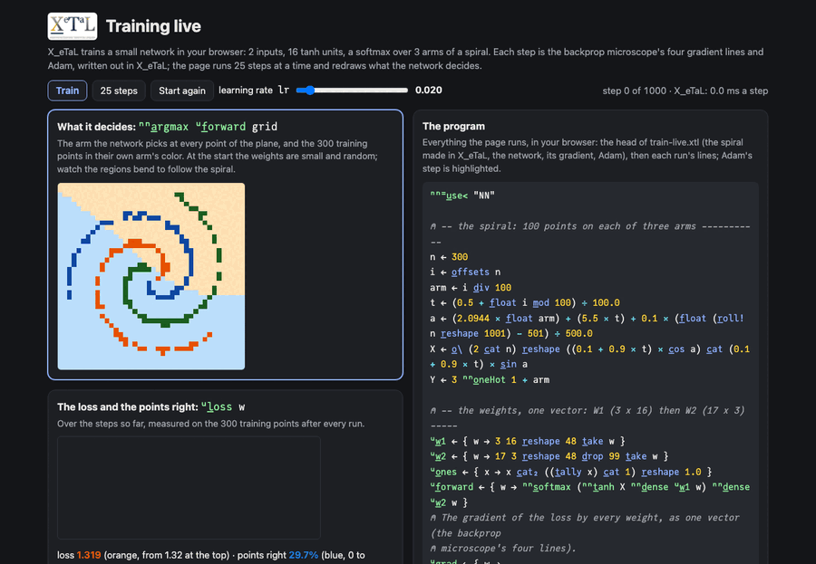

# Training live

X_eTaL trains a small network in your browser: 2 inputs, 16 tanh
units, a softmax over the 3 arms of a spiral. The points are made in
X_eTaL, the gradient is the backprop microscope's, and Adam is written
out in X_eTaL; the page runs 25 steps at a time and redraws what the
network decides, so you watch the regions bend to follow the spiral.

Live: [Training live](https://softwarewrighter.github.io/X_eTaL-ML/train-live/)
(press Train; change the learning rate and start again).

[](https://softwarewrighter.github.io/X_eTaL-ML/train-live/)

## Run it

From a clone of this repository (Rust, git and `just`):

```bash
just xetal                 # fetch and build the pinned X_eTaL (once)
just run train-live        # the loss and the points right: before, after 100 and 400 steps
just tour train-live       # each statement, then its result, paced
just serve train-live      # the web app at http://127.0.0.1:8435/
just test-demo train-live  # its CLI and browser baselines and the web app's tests
```

## The program

The spiral, 100 points on each of three arms, made in X_eTaL (a fixed
seed, so the same points every run):

```
arm := i d_iv 100
t := (0.5 + f_loat i m_od 100) / 100.0
a := (2.0944 * f_loat arm) + (5.5 * t) + 0.1 * (f_loat (r_oll! n r_eshape 1001) - 501) / 500.0
X := o_\ (2 c_at n) r_eshape ((0.1 + 0.9 * t) * c_os a) c_at (0.1 + 0.9 * t) * s_in a
```

The gradient is the [backprop microscope](../backprop/README.md)'s four
lines, returning all 99 weights' gradients as one vector. Adam, one
step:

```
u:a_dam := { s ->
  w := 99 t_ake s
  k := 1.0 + f_irst -1 t_ake s
  g := u:g_rad w
  m := (0.9 * 99 t_ake 99 d_rop s) + 0.1 * g
  v := (0.999 * 99 t_ake 198 d_rop s) + 0.001 * g * g
  ((w - lr * (m / 1.0 - 0.9 ^ k) / 0.00000001 + (v / 1.0 - 0.999 ^ k) ^ 0.5) c_at m c_at v) c_at k
}
```

Every weight moves at once, by its running average of gradients over
the square root of its running average of squared gradients (each
corrected for starting at zero). Training is then the step iterated:
`s := 25 'u:a_dam p_ower s`, no loop written.

## What it prints

The loss and the share of the 300 points right, at the start, after
100 steps and after 400: from 1.319 and 29.7% to 0.884 and 43%, then
0.062 and 100%.

## Workarounds

`p_ower` iterates one array, so the state (the 99 weights, Adam's two
averages and the step count) is packed into one vector of 298 and
taken apart in each step with `t_ake` and `d_rop`: with a state of
several arrays (a tuple or record, an X_eTaL-demos ask, M13 in
[`docs/xetal-asks.md`](../../docs/xetal-asks.md)) the step would take
and give the arrays by name.
